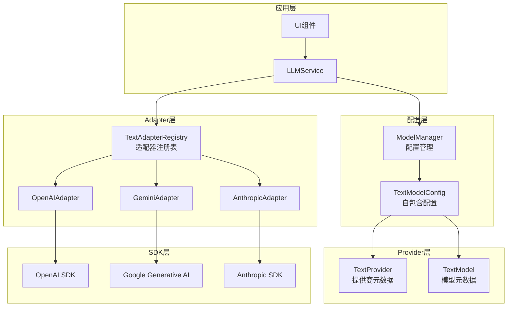
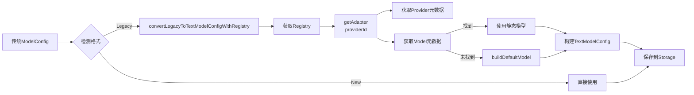

# LLM服务架构重构文档

## 概述

本文档说明Prompt Optimizer的LLM服务架构重构,从单体Service转变为**Provider-Adapter-Registry**三层架构,实现了更高的模块化、可扩展性和可维护性。

## 重构目标

1. **Provider抽象层**: 统一各LLM提供商的元数据定义(能力、参数等)
2. **Adapter统一接口**: 规范不同SDK的调用方式,隔离SDK细节
3. **配置自包含**: 配置包含完整元数据,不依赖运行时查找
4. **向后兼容**: 传统配置自动转换,保持API签名不变

## 架构设计

### 三层架构图



### 核心组件

#### 1. TextProvider (Provider元数据)

```typescript
interface TextProvider {
  id: string;                    // 'openai' | 'gemini' | 'anthropic'
  name: string;                  // 'OpenAI' | 'Google Gemini' | 'Anthropic'
  description: string;
  defaultBaseURL?: string;
  connectionSchema: ConnectionSchema;  // 连接参数定义
}
```

**职责**: 定义Provider的基本信息和连接要求

#### 2. TextModel (Model元数据)

```typescript
interface TextModel {
  id: string;                    // 'gpt-4o-mini' | 'gemini-2.0-flash-exp'
  name: string;
  description?: string;
  providerId: string;            // 归属Provider
  capabilities: {
    supportsStreaming: boolean;
    supportsTools: boolean;
    supportsReasoning: boolean;
    maxContextLength: number;
  };
  parameterDefinitions: ParameterDefinition[];
  defaultParameterValues: Record<string, any>;
}
```

**职责**: 定义Model的能力和参数

#### 3. TextModelConfig (自包含配置)

```typescript
interface TextModelConfig {
  id: string;
  name: string;
  enabled: boolean;
  providerMeta: TextProvider;     // 嵌入Provider元数据
  modelMeta: TextModel;            // 嵌入Model元数据
  connectionConfig: ConnectionConfig;  // 连接配置(apiKey, baseURL)
  paramOverrides: Record<string, any>; // 参数覆盖
}
```

**特点**:
- **自包含**: 包含运行时所需的全部信息
- **类型安全**: 完整TypeScript类型定义
- **元数据嵌入**: 无需运行时查找Provider/Model

#### 4. ITextProviderAdapter (Adapter接口)

```typescript
interface ITextProviderAdapter {
  getProvider(): TextProvider;
  getModels(): TextModel[];
  getModelsAsync?(config: TextModelConfig): Promise<TextModel[]>;
  buildDefaultModel(modelId: string): TextModel;

  sendMessage(messages: Message[], config: TextModelConfig): Promise<LLMResponse>;
  sendMessageStream(messages: Message[], config: TextModelConfig, handlers: StreamHandlers): Promise<void>;
  sendMessageStreamWithTools?(messages: Message[], config: TextModelConfig, tools: ToolDefinition[], handlers: StreamHandlers): Promise<void>;
}
```

**职责**:
- 提供Provider和Model元数据
- 封装SDK调用逻辑
- 处理消息格式转换
- 保留错误堆栈

#### 5. TextAdapterRegistry (注册表)

```typescript
class TextAdapterRegistry implements ITextAdapterRegistry {
  private adapters: Map<string, ITextProviderAdapter>;
  private staticModelsCache: Map<string, TextModel[]>;

  getAdapter(providerId: string): ITextProviderAdapter;
  getAllProviders(): TextProvider[];
  getStaticModels(providerId: string): TextModel[];
  getDynamicModels(providerId: string, config: TextModelConfig): Promise<TextModel[]>;
  getModels(providerId: string, config?: TextModelConfig): Promise<TextModel[]>;
}
```

**职责**:
- 注册和管理所有Adapter实例
- 提供统一的Adapter查找接口
- 缓存静态模型列表
- 支持动态模型获取(OpenAI)

## 配置迁移流程

### 传统配置 → 新配置



### 转换逻辑 (converter.ts)

```typescript
export async function convertLegacyToTextModelConfigWithRegistry(
  key: string,
  legacy: ModelConfig,
  registry: ITextAdapterRegistry
): Promise<TextModelConfig> {
  // 1. Provider映射
  const providerId = mapProviderToAdapterId(legacy.provider);

  // 2. 获取Adapter
  const adapter = registry.getAdapter(providerId);

  // 3. 获取Provider元数据
  const providerMeta = adapter.getProvider();

  // 4. 获取Model元数据
  let modelMeta = adapter.getModels().find(m => m.id === legacy.defaultModel);
  if (!modelMeta) {
    modelMeta = adapter.buildDefaultModel(legacy.defaultModel);
  }

  // 5. 构建TextModelConfig
  return {
    id: key,
    name: legacy.name,
    enabled: legacy.enabled,
    providerMeta,
    modelMeta,
    connectionConfig: {
      apiKey: legacy.apiKey,
      baseURL: legacy.baseURL
    },
    paramOverrides: legacy.llmParams || {}
  };
}
```

**Provider映射规则**:
- `gemini` → `gemini` (GeminiAdapter)
- `anthropic` → `anthropic` (AnthropicAdapter)
- `openai` | `deepseek` | `zhipu` | `siliconflow` | `custom` → `openai` (OpenAIAdapter)

### 自动转换时机

在`ModelManager.init()`初始化时:

```typescript
async init(): Promise<void> {
  const existingModels = await this.getModelsFromStorage();

  for (const [key, existingModel] of Object.entries(existingModels)) {
    if (isLegacyConfig(existingModel)) {
      try {
        // 优先使用Registry转换
        const registry = await this.getRegistry();
        const convertedModel = await convertLegacyToTextModelConfigWithRegistry(
          key,
          existingModel,
          registry
        );
        updatedModels[key] = convertedModel;
        hasUpdates = true;
      } catch (error) {
        // Fallback到硬编码转换
        const convertedModel = convertLegacyToTextModelConfig(key, existingModel);
        updatedModels[key] = convertedModel;
      }
    }
  }

  // 保存转换后的配置
  if (hasUpdates) {
    await this.saveModelsToStorage(updatedModels);
  }
}
```

## Service层集成

### LLMService使用Registry

```typescript
export class LLMService implements ILLMService {
  constructor(
    private modelManager: ModelManager,
    private registry: ITextAdapterRegistry
  ) {}

  async sendMessage(messages: Message[], provider: string): Promise<string> {
    // 1. 获取配置
    const config = await this.modelManager.getModel(provider) as TextModelConfig;

    // 2. 获取Adapter
    const adapter = this.registry.getAdapter(config.providerMeta.id);

    // 3. 调用Adapter
    const response = await adapter.sendMessage(messages, config);

    return response.content;
  }
}
```

**关键特性**:
- 通过`config.providerMeta.id`获取正确的Adapter
- 无需switch/case Provider类型
- SDK调用完全由Adapter封装
- 错误堆栈保留

### 工厂函数

```typescript
export function createLLMService(modelManager: ModelManager): ILLMService {
  if (isRunningInElectron()) {
    return new ElectronLLMProxy();
  }

  // 创建Registry实例
  const registry = new TextAdapterRegistry();

  // 注入Registry到Service
  return new LLMService(modelManager, registry);
}
```

## 开发者指南

### 如何添加新Provider

#### 1. 创建Adapter实现

```typescript
// packages/core/src/services/llm/adapters/example-adapter.ts
import { AbstractTextProviderAdapter } from './abstract-adapter';
import type { TextProvider, TextModel, TextModelConfig, LLMResponse, Message, StreamHandlers } from '../types';

export class ExampleAdapter extends AbstractTextProviderAdapter {
  getProvider(): TextProvider {
    return {
      id: 'example',
      name: 'Example Provider',
      description: 'Example LLM Provider',
      defaultBaseURL: 'https://api.example.com/v1',
      connectionSchema: {
        required: ['apiKey'],
        optional: ['baseURL'],
        fieldTypes: {
          apiKey: 'string',
          baseURL: 'url'
        }
      }
    };
  }

  getModels(): TextModel[] {
    return [
      {
        id: 'example-model-v1',
        name: 'Example Model V1',
        description: 'Fast and efficient model',
        providerId: 'example',
        capabilities: {
          supportsStreaming: true,
          supportsTools: false,
          supportsReasoning: false,
          maxContextLength: 8000
        },
        parameterDefinitions: [
          {
            name: 'temperature',
            type: 'number',
            description: 'Sampling temperature',
            min: 0,
            max: 2,
            default: 0.7
          }
        ],
        defaultParameterValues: {
          temperature: 0.7
        }
      }
    ];
  }

  protected async doSendMessage(
    messages: Message[],
    config: TextModelConfig
  ): Promise<LLMResponse> {
    // 实现SDK调用逻辑
    const client = new ExampleSDK({
      apiKey: config.connectionConfig.apiKey,
      baseURL: config.connectionConfig.baseURL || this.getProvider().defaultBaseURL
    });

    try {
      const response = await client.chat.completions.create({
        model: config.modelMeta.id,
        messages: messages,
        ...config.paramOverrides
      });

      return {
        content: response.choices[0].message.content || '',
        reasoning: undefined,
        metadata: {
          model: config.modelMeta.id,
          usage: response.usage
        }
      };
    } catch (error: any) {
      // 保留原始错误堆栈
      throw error;
    }
  }

  protected async doSendMessageStream(
    messages: Message[],
    config: TextModelConfig,
    handlers: StreamHandlers
  ): Promise<void> {
    // 实现流式调用逻辑
    const client = new ExampleSDK({
      apiKey: config.connectionConfig.apiKey,
      baseURL: config.connectionConfig.baseURL
    });

    try {
      const stream = await client.chat.completions.create({
        model: config.modelMeta.id,
        messages: messages,
        stream: true,
        ...config.paramOverrides
      });

      for await (const chunk of stream) {
        const content = chunk.choices[0]?.delta?.content || '';
        if (content && handlers.onToken) {
          handlers.onToken(content);
        }
      }

      if (handlers.onComplete) {
        handlers.onComplete({ content: '', metadata: {} });
      }
    } catch (error: any) {
      if (handlers.onError) {
        handlers.onError(error);
      }
      throw error;
    }
  }
}
```

#### 2. 注册到Registry

```typescript
// packages/core/src/services/llm/adapters/registry.ts
import { ExampleAdapter } from './example-adapter';

export class TextAdapterRegistry implements ITextAdapterRegistry {
  private adapters: Map<string, ITextProviderAdapter>;

  constructor() {
    this.adapters = new Map();
    this.staticModelsCache = new Map();

    // 注册所有Adapter
    this.adapters.set('openai', new OpenAIAdapter());
    this.adapters.set('gemini', new GeminiAdapter());
    this.adapters.set('anthropic', new AnthropicAdapter());
    this.adapters.set('example', new ExampleAdapter());  // 新增
  }
}
```

#### 3. 更新配置转换逻辑 (如需要)

```typescript
// packages/core/src/services/model/converter.ts
function mapProviderToAdapterId(provider: string): string {
  switch (provider) {
    case 'gemini':
      return 'gemini';
    case 'anthropic':
      return 'anthropic';
    case 'example':  // 新增
      return 'example';
    case 'openai':
    case 'deepseek':
    case 'zhipu':
    case 'siliconflow':
    case 'custom':
    default:
      return 'openai';
  }
}
```

## 常见问题 (FAQ)

### Q1: 为什么要重构为Adapter模式?

**A**:
1. **解耦SDK**: 不同SDK的调用逻辑分离,易于维护和测试
2. **统一接口**: 所有Provider遵循相同接口,简化Service层逻辑
3. **扩展性**: 添加新Provider只需实现Adapter,无需修改Service
4. **可测试性**: Adapter可独立Mock和测试

### Q2: 传统配置如何迁移?

**A**: 自动迁移,无需手动操作:
1. ModelManager初始化时检测传统配置
2. 自动调用`convertLegacyToTextModelConfigWithRegistry()`
3. 转换后保存到Storage
4. 下次加载直接识别为新格式

### Q3: TextModelConfig为什么要嵌入元数据?

**A**:
1. **自包含**: 运行时无需查找Provider/Model元数据
2. **类型安全**: 完整类型定义,IDE智能提示
3. **性能**: 避免运行时查找,直接访问
4. **可追溯**: 配置包含完整历史信息

### Q4: 如何处理SDK错误?

**A**: Adapter必须保留原始错误堆栈:

```typescript
try {
  const response = await sdk.call();
} catch (error: any) {
  // 直接throw,不要包装,保留原始堆栈
  throw error;
}
```

### Q5: 如何支持动态模型获取?

**A**: 实现`getModelsAsync()`方法:

```typescript
async getModelsAsync(config: TextModelConfig): Promise<TextModel[]> {
  const client = new OpenAI({
    apiKey: config.connectionConfig.apiKey,
    baseURL: config.connectionConfig.baseURL
  });

  const response = await client.models.list();

  return response.data.map(model => ({
    id: model.id,
    name: model.id,
    description: '',
    providerId: 'openai',
    capabilities: { /*...*/ },
    parameterDefinitions: [],
    defaultParameterValues: {}
  }));
}
```

Registry会自动fallback到静态模型。

### Q6: Provider映射规则是什么?

**A**:
- **Gemini**: `gemini` → GeminiAdapter (Google SDK)
- **Anthropic**: `anthropic` → AnthropicAdapter (Anthropic SDK)
- **OpenAI及兼容**:
  - `openai` → OpenAIAdapter
  - `deepseek` → OpenAIAdapter (OpenAI兼容)
  - `zhipu` → OpenAIAdapter (OpenAI兼容)
  - `siliconflow` → OpenAIAdapter (OpenAI兼容)
  - `custom` → OpenAIAdapter (OpenAI兼容)

## 测试策略

### 单元测试

- **Adapter测试**: Mock SDK,测试数据转换和错误处理
- **Registry测试**: 测试Adapter注册、查找、缓存逻辑
- **转换测试**: 测试传统配置 → 新配置映射正确性

### 集成测试

- **Adapter集成**: 使用真实API密钥测试SDK调用
- **迁移集成**: 测试配置自动转换和持久化
- **回归测试**: 验证API签名和行为不变

## 相关链接

- [需求文档](../../.spec-workflow/specs/text-model-provider-refactor/requirements.md)
- [设计文档](../../.spec-workflow/specs/text-model-provider-refactor/design.md)
- [任务文档](../../.spec-workflow/specs/text-model-provider-refactor/tasks.md)
- [LLM Service源码](../../packages/core/src/services/llm/service.ts)
- [Adapter目录](../../packages/core/src/services/llm/adapters/)
